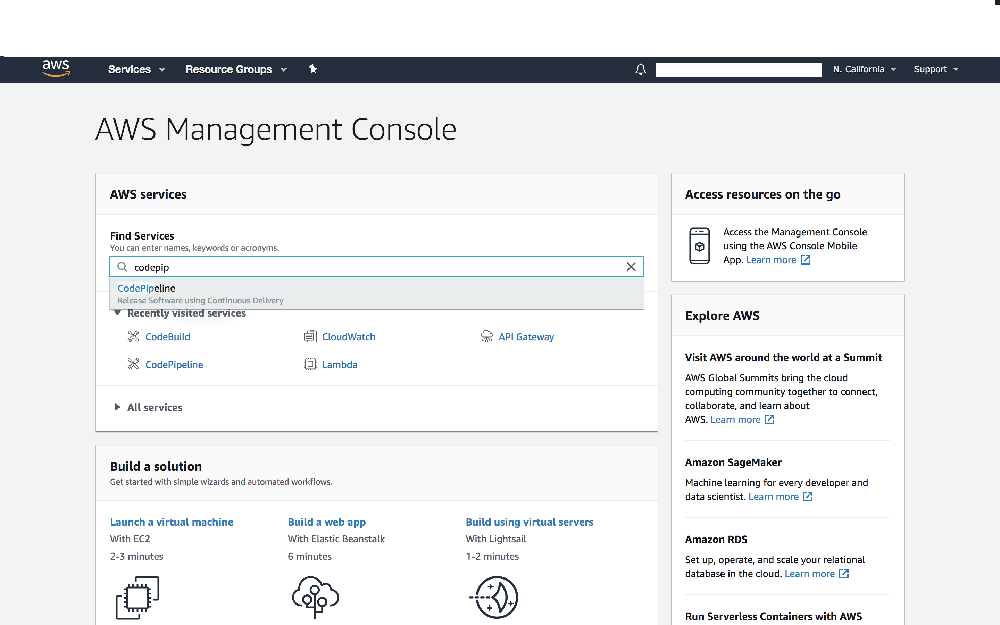
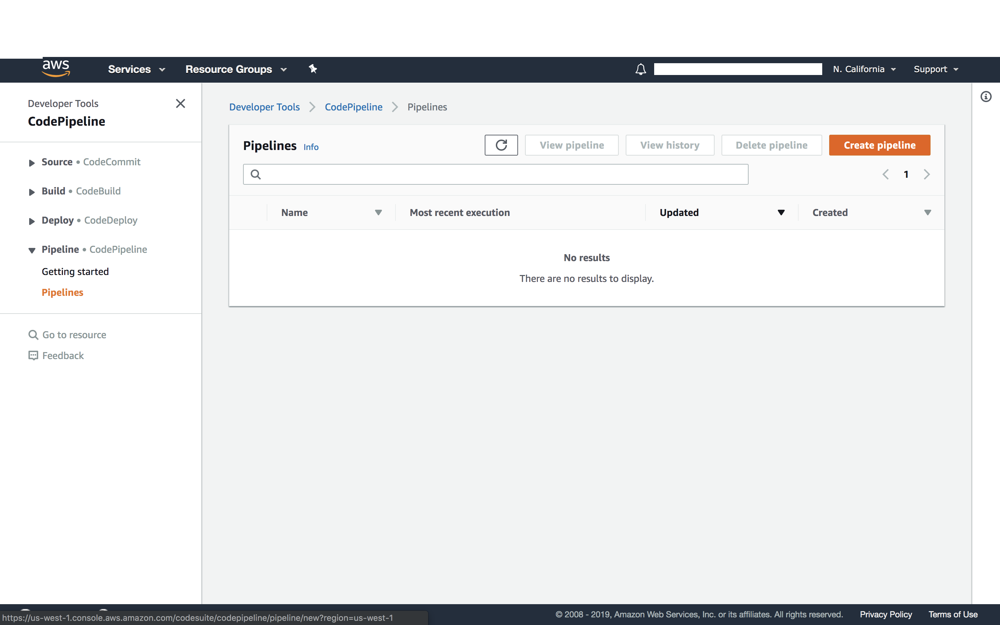
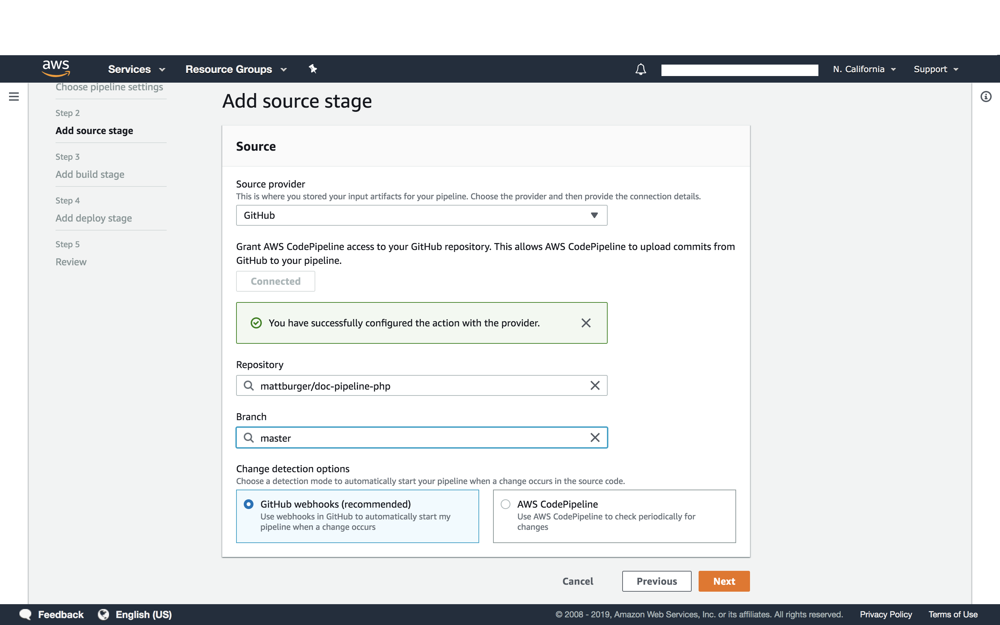
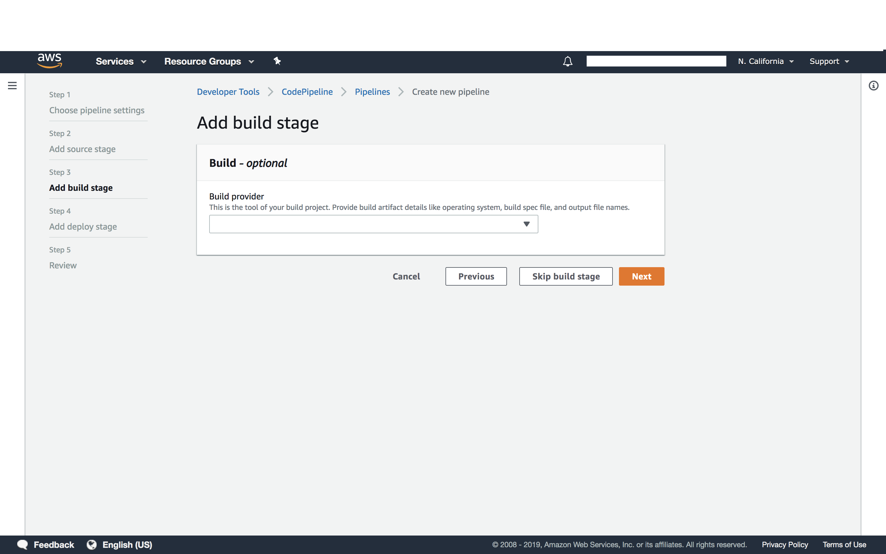
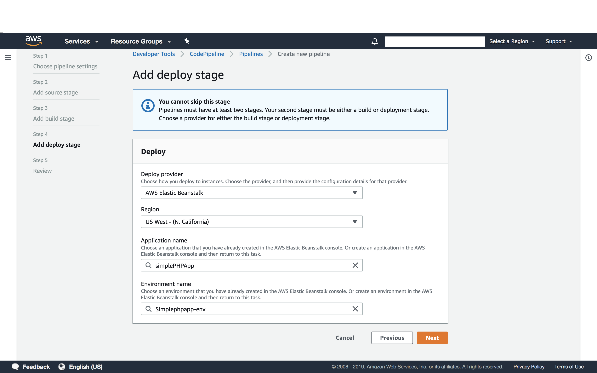
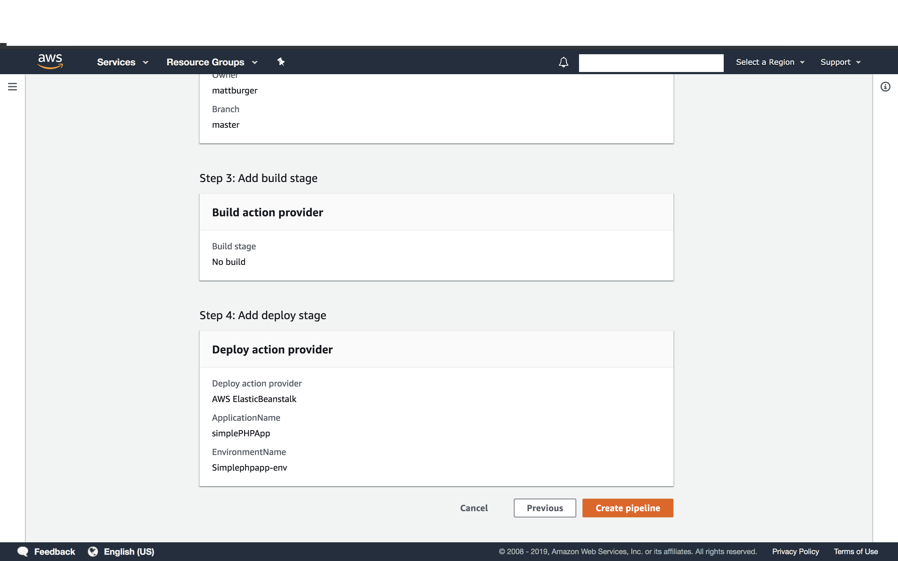

# Simple PHP Application
This is a simple php application that is deployed onto AWS Elasticbeanstalk, using AWS Code pipeline.

[Deployed Site](http://simplephpapp.us-west-1.elasticbeanstalk.com/)

## How to deploy using AWS Code Pipeline

###Basic Setup:
* Within AWS Console, navigate to [code pipeline](https://us-east-2.console.aws.amazon.com/codesuite/codepipeline/start?region=us-east-2)
    

* Create new pipeline using create button
    
* Configure pipeline settings you can either use an existing role or have Code Pipeline create one for you
    
    * Add a source provider: Github
      * If you choose github, make sure to select Github's Webhooks, to enable change detection 
         
         
        * **NOTE**: Build stage is optional
           
    * Configure deployment stage:
    *  **NOTE**: Your ec2, ecs, ebs instance must be created before you can finish setup.
       
       
    * Review and create:
       
  
  

###Once Deployed:
* You should receive a success message
  

* You can now continue to update your repo, and the pipeline should handle updating your deployed site

  

